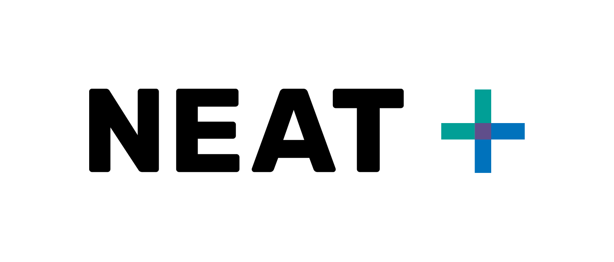

Humanitarian projects often prioritizes immediate action over longer term impacts. However, accounting for both is critical. The environment is vital to humanitarian action for [several reasons](https://www.unep.org/explore-topics/disasters-conflicts/what-we-do/preparedness-and-response/environmental):

1. Environmental issues often cause or contribute to humanitarian crises.
2. Humanitarian crises often negatively effect the environment.
3. Environmental degradation can often limit recovery from humanitarian crises, which can in turn can cause or contribute to future crises.

It is difficult for humanitarians and those suffering from crises to fully and rapidly account for the environment, when immediate need is more time sensitive.

The [NEAT+](www.neatplus.org) helps humanitarians to quickly screen for and identifiy issues of environmental concern. Through easy-to-understand questions, and standardized responses, the NEAT+ turns abiguity into clarity by presenting a ranked list of _environmental sensitivities_ (risks to look out for) and related _mitigations_ (how to minimize the risk) and _opportunities_ (long-term net-positive solutions).

I work on all aspects of the NEAT+, in collaboration with technical and environmental experts. Currently, it exists in two formats:

1. The [Rural NEAT+](https://www.eecentre.org/neat) (built in 2018 with [The Joint Initiative](https://eecentre.org/2017/01/01/the-joint-initiative/)), using Excel and [KoboToolbox](https://www.kobotoolbox.org/).
2. The [Urban NEAT+](https://www.neatplus.org), which uses a custom Python/Django web application (not coded by me).

The tool is used by many large humanitarian orgnizations. Feel free to [try these open source tools out yourself](https://www.neatplus.org).
