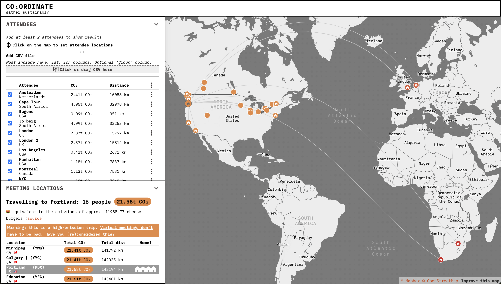
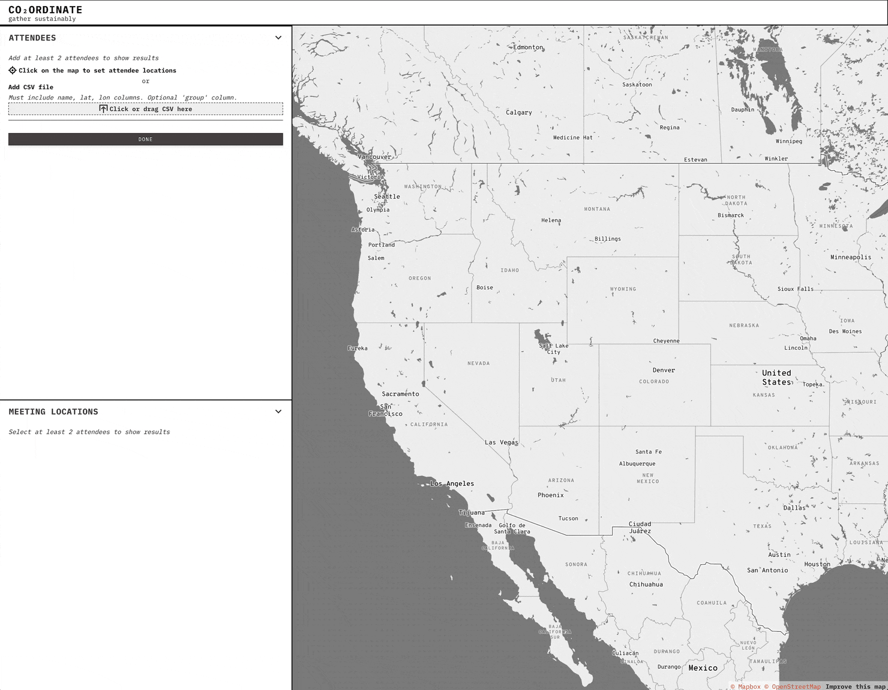
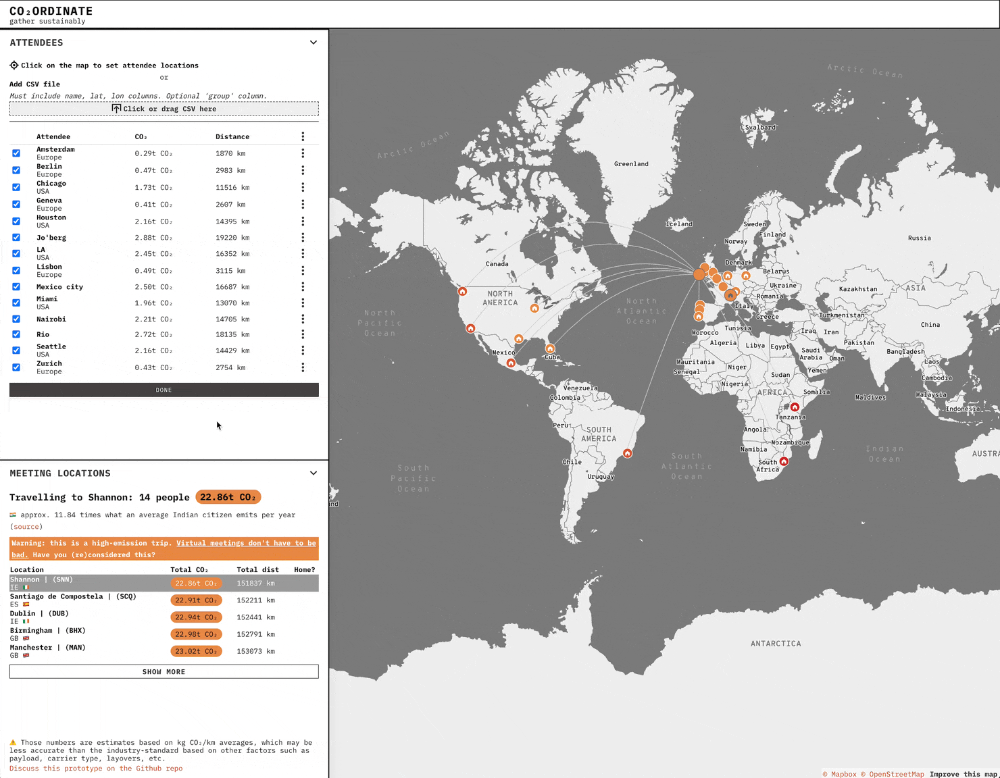

[Co₂ordinate](https://devseed.com/co2ordinate/) was created as an internal tool to organize our first annual company Team Week meeting. It allows you to select which team members need to meet, and Co₂ordinate will rank the most efficient places to gather. This ranking is based on locations with fewer flight-related GHG emissions for a group of team members. The selection is geared towards places close to at least one team member.

This was a fun but challenging project. We had to balance:

- Accuracy
- Approachability
- Budget (commercial flight data is expensive)
- Time (we only had limited hours to design and build the thing)

Overall, we built a beautiful _low-resolution_ tool to get users away from the most impactful locations and towards the least impactful ones.

People can be added by clicking on the map or uploading a .csv, and can be grouped by teams. Data is stored locally in the browser.

Hopefully we can improve the tool's accuracy in the future, and incorporate train and bus travel to discourage unnecessary flights.

Learn more from [this blog post](https://developmentseed.org/blog/2023-10-11-co2ordinate).
