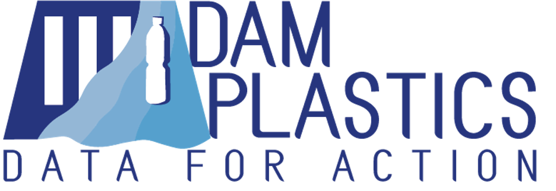

Plastic is arguably the material that has affected human society in the most dramatic way. When plastic was first created over one hundred years ago, it had everything required to be the production material of the future - strength, durability, moldability, and most importantly, incredibly low cost.

However, almost all of the plastic ever created still exists in many forms and in many locations. Since plastics were first introduced, over 8.1 billion tonnes have been created; 6.3 billion tonnes have become plastic waste; and only nine percent of that waste has been recycled.[^1]

Plastic pollution in oceans is an important and well-documented sustainability issue, yet how this plastic gets there is not well understood.

Dam Plastics attempts to measure and monitor the flow of plastic through riverine systems by linking dam operators and citizen scientists through a procedural toolkit to create standardized, actionable data about riverine plastic waste.

The project implemented a pilot on the Rhône river in the greater Geneva area. We have received continued interest through several dam operators, electricity utility companies, and several startup incubators.

A toolkit for dam operators and citizen scientists was also created.

Learn more [here](http://www.damplastics.org).

---

[^1]: Dufour, F. (2018). _A whopping 91% of plastic isn't recycled._ Retrieved from [https://www.nationalgeographic.com/news/2017/07/plastic-produced-rec](https://www.nationalgeographic.com/news/2017/07/plastic-produced-recycling-waste-ocean-trash-debris-environment/)[cling-waste-ocean-trash-debris-environment/](https://www.nationalgeographic.com/news/2017/07/plastic-produced-recycling-waste-ocean-trash-debris-environment/).
