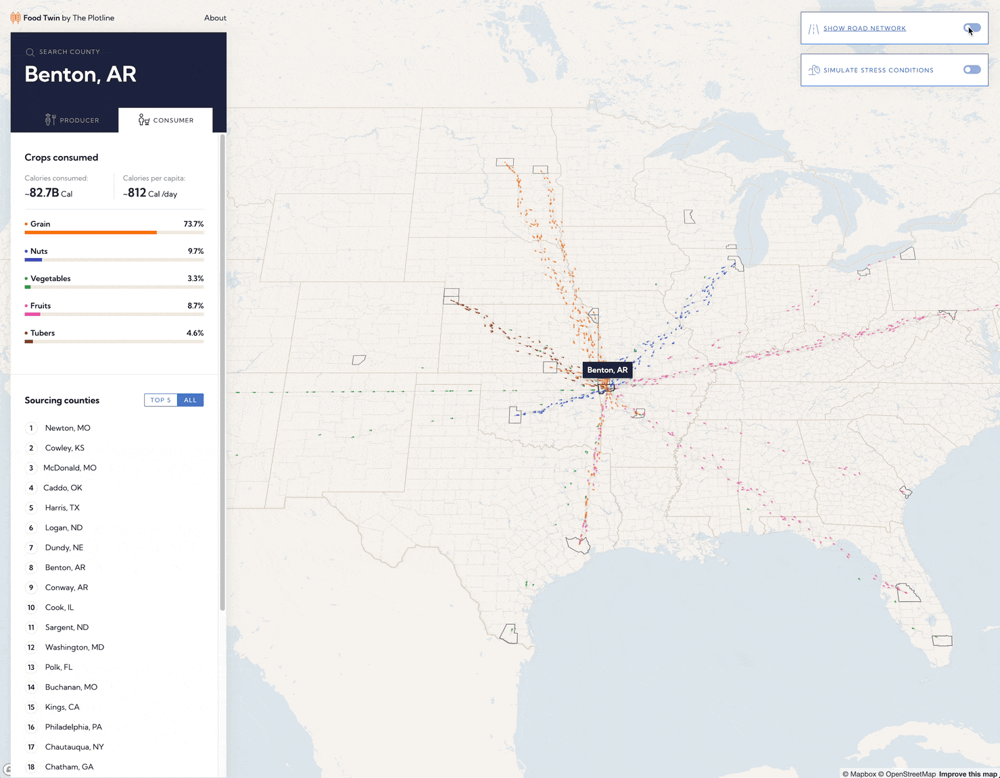
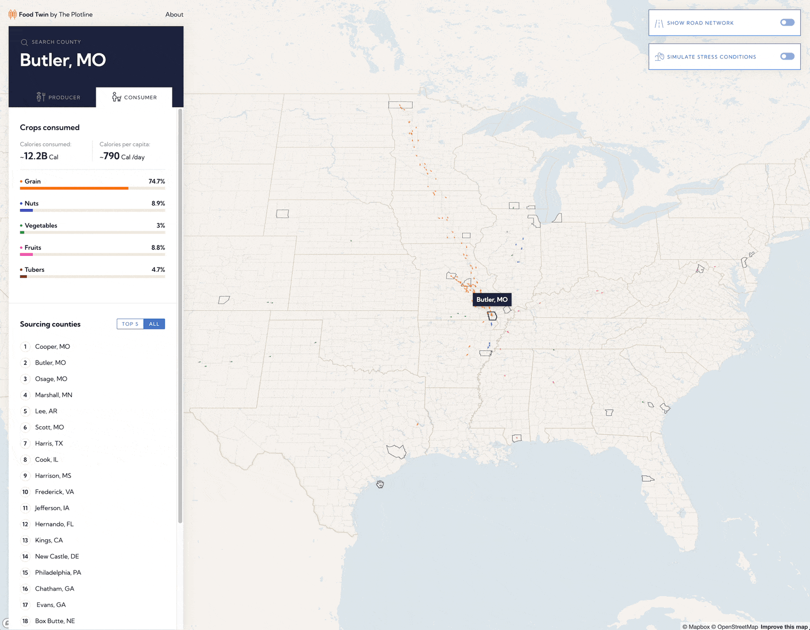

Recent events such as the COVID-19 pandemic and Russia’s invasion of Ukraine have revealed inherent gaps in the way food systems are modeled. Digital twins of food systems hold massive potential to fill the decision making under food crises, including those caused or exacerbated by climate change.

[Food Twin](https://food.theplotline.org/) is built on an innovative model built by [The Plotline](https://theplotline.org/) team. The model uses the USDA’s Cropland Data Layer to generate an estimate of the types of crops that are grown in different regions across the United States along with data on imported foods. Food Availability surveys and census data were used to model consumption.

The model allowed for Development Seed to not only visualize calorie flows, but also differentiate between crop groups and crop types. The resulting tool is an elegant and intuitive way for users to explore calorie flows between counties, both from the consumption and production perspective.

The US highway network was introduced to expose vulnerabilities in the food supply chain network due to crises or conflicts. Showing where these calorie particles flow and join can provide valuable insights into food distribution.

Searching for counties is simple – either hover over any county to see its name, or use the dedicated search interface.

The biggest challenge was design. Various colors, shapes, and movements needed to complement each other, not overwhelm users. The end result is a juxtaposition – simple yet complex, immersive yet clear.

An expanded version of Food Twin could serve the humanitarian and international development communities well. Understanding calorie flows at the international level could be helpful to understand the impacts of a conflict or disaster, or even to predict where the next conflict or shortage could be.

More generally, there's potential for using Food Twin as the basis of building out other visualizations of geospatial data that moves between locations.