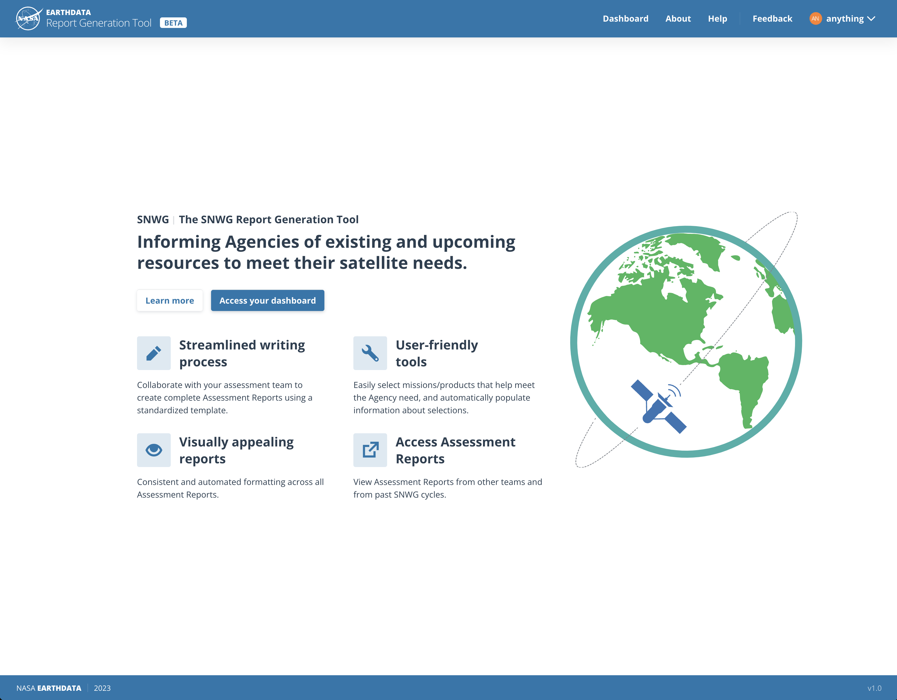
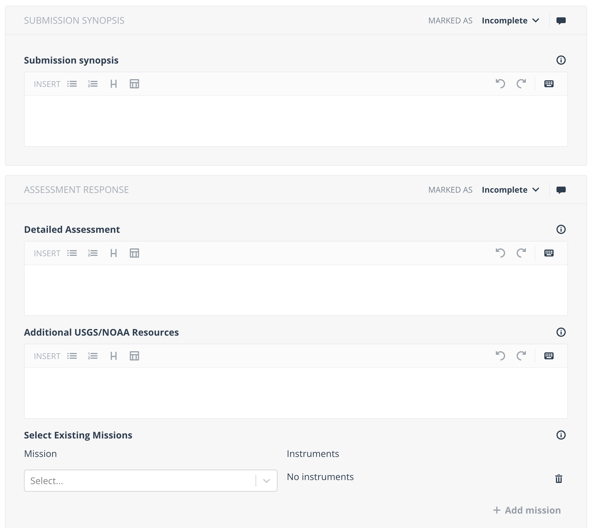
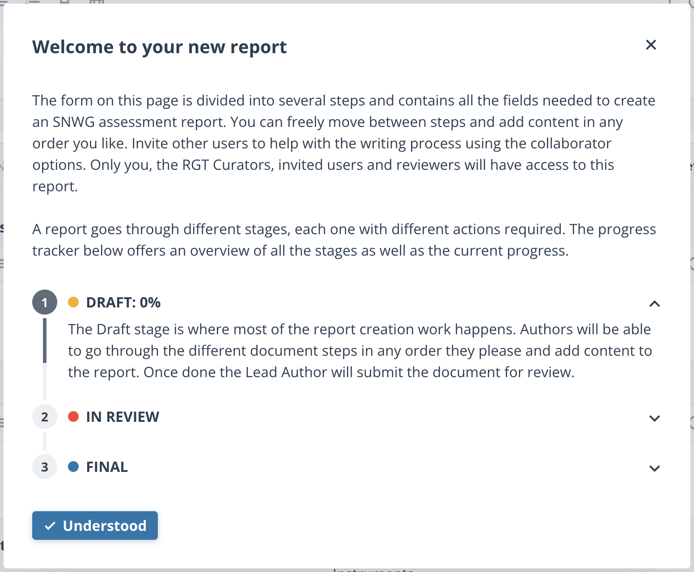

NASA coordinates with other U.S. Government satellite data providers to identify, communicate, and address Earth observation needs of Federal agencies. The SNWG tooling consists of project project management software (Asana) linked to a custom report writing tool, called the Report Generation Tool (RGT). These reports are sent to the White House for budgetary review.

Reports written in RGT follow the same template to ensure the same structure across reports. Referencing other satellites or data products is simple and keeps the data up to date and standardized across reports.

Users are guided through the report writing process, and are assigned to their relevant reports. Reviewers are notified once reports are ready for review, and administrators have an overview of the whole process.

Users and administrators liked its simplicity, ease of use, and time savings. More info can be found [here](https://impactunofficial.medium.com/streamlining-satellite-needs-assessments-with-the-report-generation-tool-d6f34a348133).
