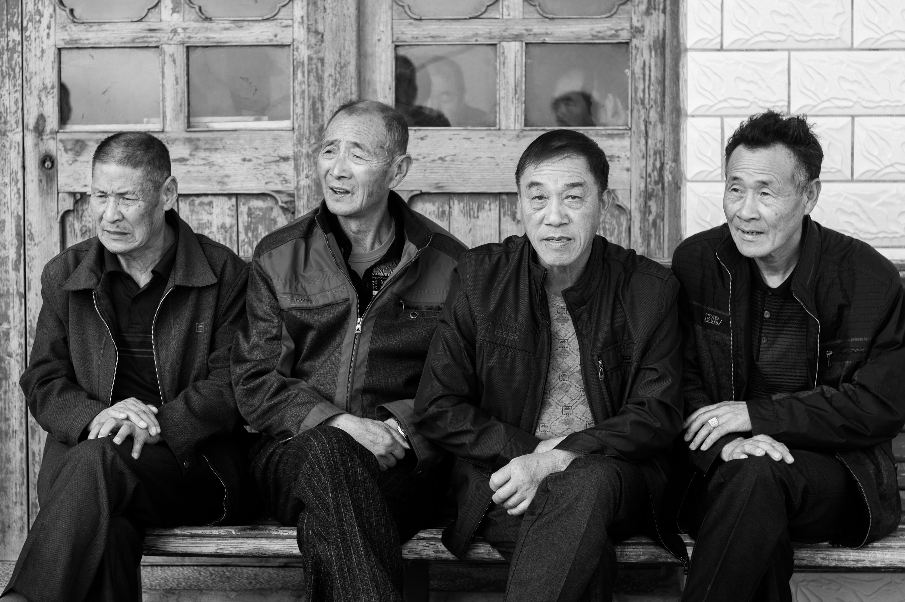
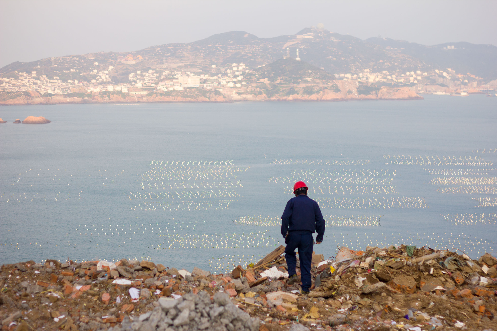
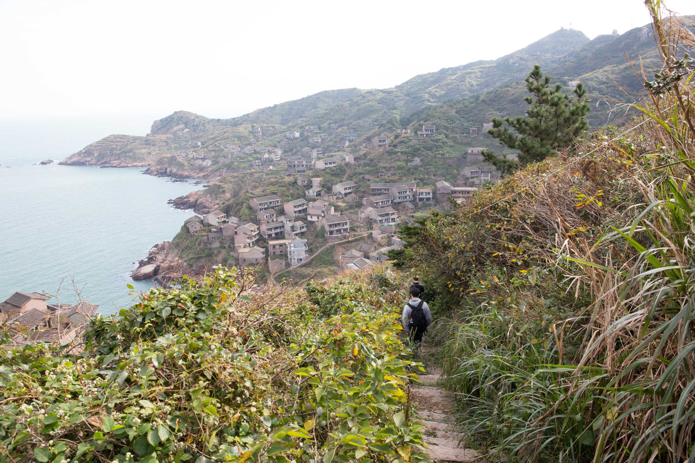
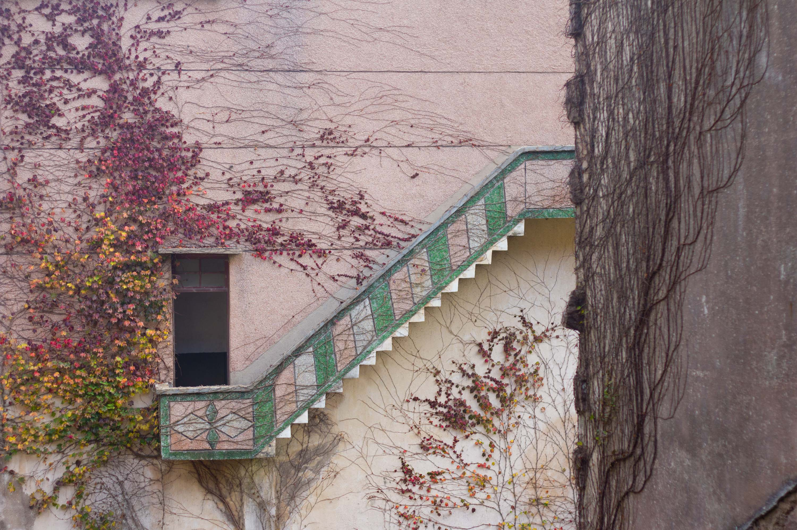
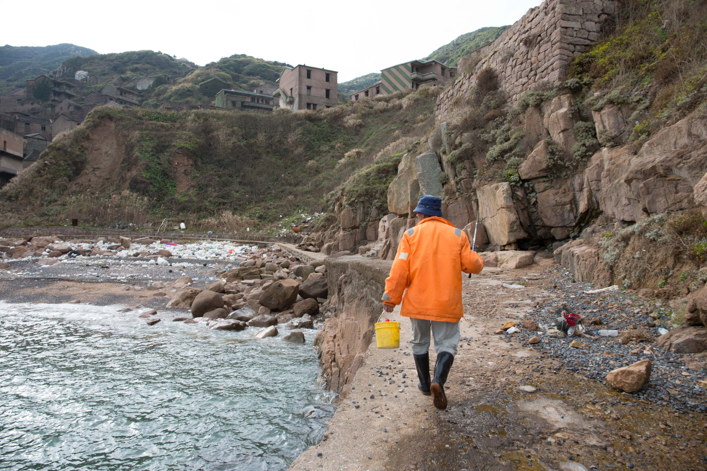
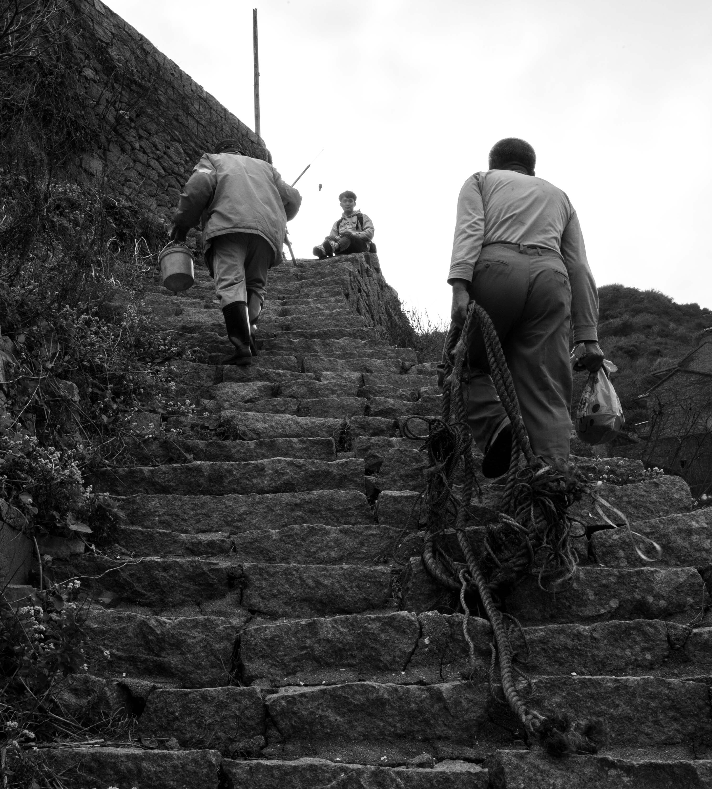
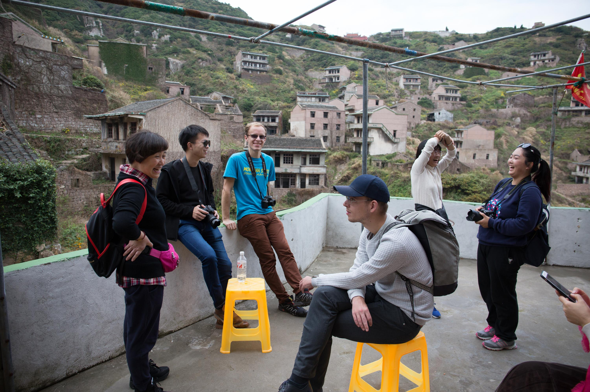
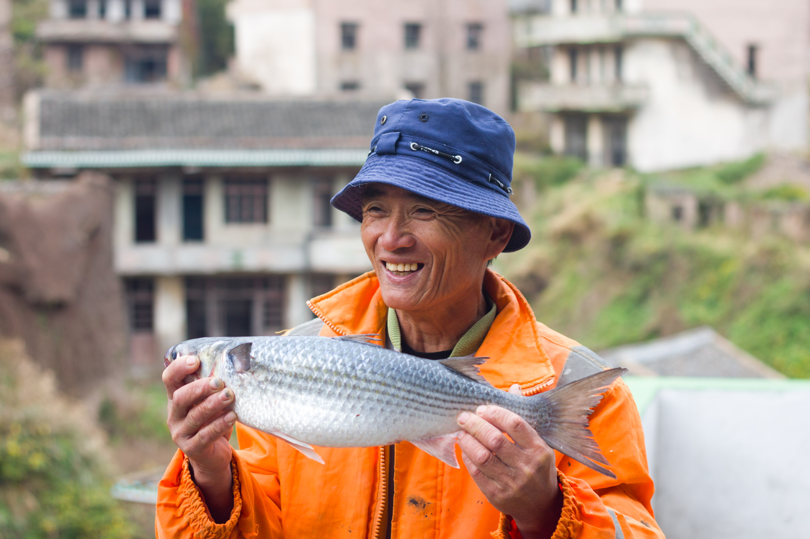
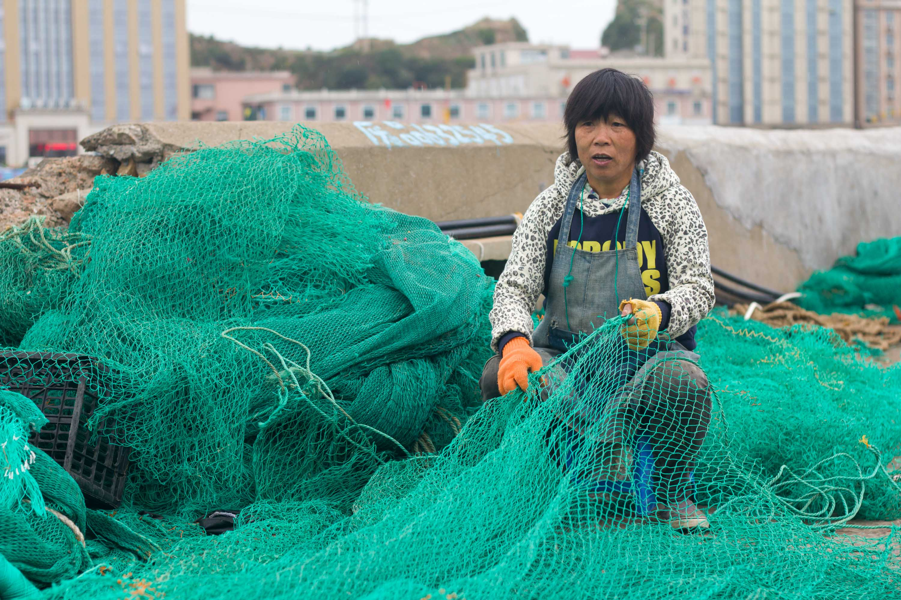
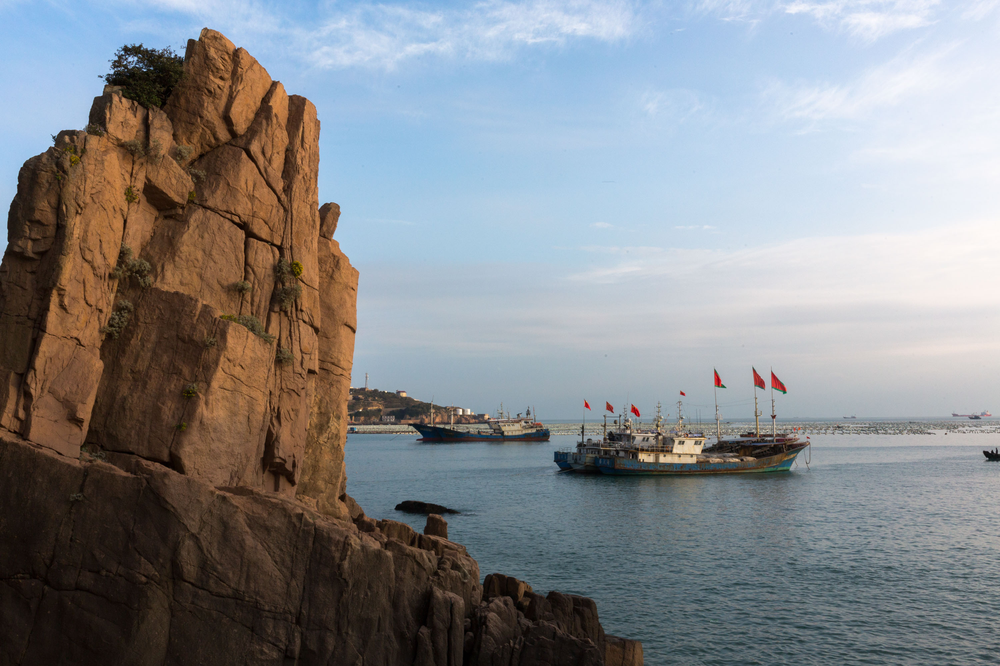

“Autumn isn’t bad, but you should be here in the summer. The water is bluer, the vegetation is greener, and the air is cleaner,” said the taxi driver after our boat had arrived on a cold winter’s afternoon.

The taxi drivers of Goǔqǐ Island `枸杞岛` hadn’t seen much trade of late but, after our surprisingly long journey, our personal chauffeur of the island was more than happy to sing the praises of his faraway home. Coming from the persistent grey haze of the Shanghai ‘Big Smoke’, we immediately saw the benefits of the pure island air.

Goǔqǐ island, together with neighboring Shèngshān Island `嵊山岛`, are best known for Houtouwan, an abandoned fishing village on the northern coast of Shèngshān Island. During it’s prime in the 1980’s, over 3,000 residents called this place their home. However, the attractiveness of a faster life on the other side of the island, and nearby Shanghai, pulled most of the residence away, leaving fewer and fewer as time passed by. Today, only rumor of an old lady and one lonely fisherman remain.

As we descended into the village, we caught a glimpse of an orange coated figure with a fishing rod in his hand and a bucket by his feet. Curiosity lead us to dash over to the man. While his catch wasn’t impressive, he proudly told us to follow him to his house and see his previous luck.

His house looked the same on the outside as all the others – abandoned, decrepit, diminishing, yet full of life. Usually this village is overrun with vibrant green moss and vines, however, winter gave this place a different appearance, and a feeling of warmth from the interaction between the few amongst us – our group of five, one other party of four nurses, and the fisherman and his friend.

His face lit up as he proudly held his trophy catch from the early morning.

This time of the year is much more relaxed. Much of the island’s income comes from the busy summer months of tourism – once the tourists return to the mainland, the locals who aren’t fishing are free to relax and enjoy their views in peace.

We met a large group of elderly residents doing just this shortly after we arrived. As our lives appeared so different, conversation naturally ensued. One man was especially proud of his island. “This is the easternmost point in mainland China. We’re first to see the sunrise,” he proclaimed. While technically wrong (North-eastern China holds that title), his enthusiasm was more than enough to have us nodding in agreement.

_Originally written with Hibshy Samsadin on January 14th, 2018 for Clamp Magazine from a trip in late 2017. Published here on December 8th, 2020._
