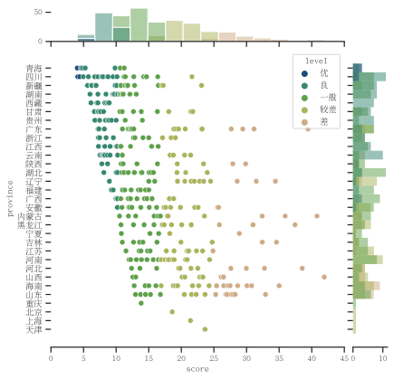

## TL;DR
Writing in [Markdown](https://en.wikipedia.org/wiki/Markdown) is great. [Zettlr](https://www.zettlr.com/) is a great Markdown editor, which pairs well with [Zotero](https://www.zotero.org/) to manage citations. Publishing with [Jupyter Book](https://jupyterbook.org/) allows for good design and makes academic writing more accessible. 

You can read my thesis [here]({{ base.url }}/china-water).

## Background

I attended Tsinghua University 清华大学 between 2018 and 2021 and received a Master in Public Administration for the Sustainable Development Goals. Since the SDGs are (by definition) broad and all encompassing, so too was the program. While both a blessing and a curse, it did allow students to pursue courses, research and careers in the areas they were most passionate about.

Issues related to water have interested me since work I did with Engineers without Borders, where my classmates and I implemented several Water, Sanitation and Hygiene (WASH) projects at primary schools in western Kenya. Having experienced China's environmental degradation first-hand for the two years, tying these two together seemed logical.

## Topic

After some time and discussion, I landed on the topic of comparing how people *perceived* water quality, and to a larger extent environmental degradation, with actual water quality. China suffers from quite bad levels of water pollution, but some areas are much worse off than others. Understanding if perceptions aligned with reality has many implications, including life satisfaction and political stability.

<!-- FIGURE OUT "CAPTIONING"

-->

## Data

Two datasets seemed to best cover the issue. One is a dataset of water quality scores at the sub-province level (similar to counties in the US or *communes* in Switzerland). The other is a large time series social survey, which includes questions related to environmental degradation and water quality.

At the time, and in addition to the thesis, I had wanted to learn Python. Luckily for me, the social survey data set was massive, and I didn't have SPSS on my computer. Trying to open the data set in Excel quickly crashed it, so Python was the best option!

The data analysis aspects of the thesis are documented in this [Github repository](https://github.com/wrynearson/china-water), and hopefully soon in the [Jupyter Book Thesis]({{ base.url }}/china-water).

## Writing

The literature review and writing portion mostly took place in [Zettlr](https://www.zettlr.com/) and [Zotero](https://www.zotero.org/). Once Zotero and Zettlr were linked, referencing was a breeze – just typing the @ symbol, followed by either the title or author. The setup process took a bit of time, but I found it to be worth it. There is extensive documentation and guidance on Zettlr's website.

Tsinghua University was very strict about the Word document template that the thesis needed to be submitted as. I think it would have been possible to find a LaTeX template and export from Zettlr, but I couldn't figure it out, so I unfortunately had to copy and paste into the Word doc.

## Sharing

After defending the thesis and moving on to [other projects]({{ base.url }}/NEAT+), I thought less and less frequently of it. Months later, I found it a bit sad that so many pieces of academic writing, if not published in journals, accumulate digital dust in methaphorical filing cabinates. I wanted a way to show my work, but not through a static PDF.

Jupyter Book attempts to solve this problem. In their words:

> Jupyter Book is an open source project for building beautiful, publication-quality books and documents from computational material.

Markdown, computational material (i.e., code and its output), and good aethetics all sounded like a perfect fit for my goal.

After some time re-copying my updated text from Word back into Markdown (oh, the irony of Markdown's aim to make text more interoperable and accessible), and formatting some of the tables and citations (since Zettlr and Jupyter Book don't follow the same Markdown standard), the "book" was ready! Hosting it on GitHub was straightforward.

As of now, only the output graphs are in Jupyter Book, not the actual code to create them. My code is in a few Jupyter notebooks, and since I didn't write the text of the thesis in there (which would have been possible), it would have taken some time to merge the two together. The next step would be to merge these two to then disply the code and the generated figures in the Jupyter Book thesis.

## Summary

For all thesis, I would recommend writing in Markdown, and specifically in Zettlr and Zotero. Markdown forces you to focus on the text, not the markup, and it helped me to write more clearly and quickly. Zettlr with Zotero made citations enjoyable. Making tables was definitely the most tedious part, which is a limitation of Markdown, but Zettlr helps. 

Mostly, the process kept me aware of how text, data and images are stored, and made me think more about the content than the formatting.