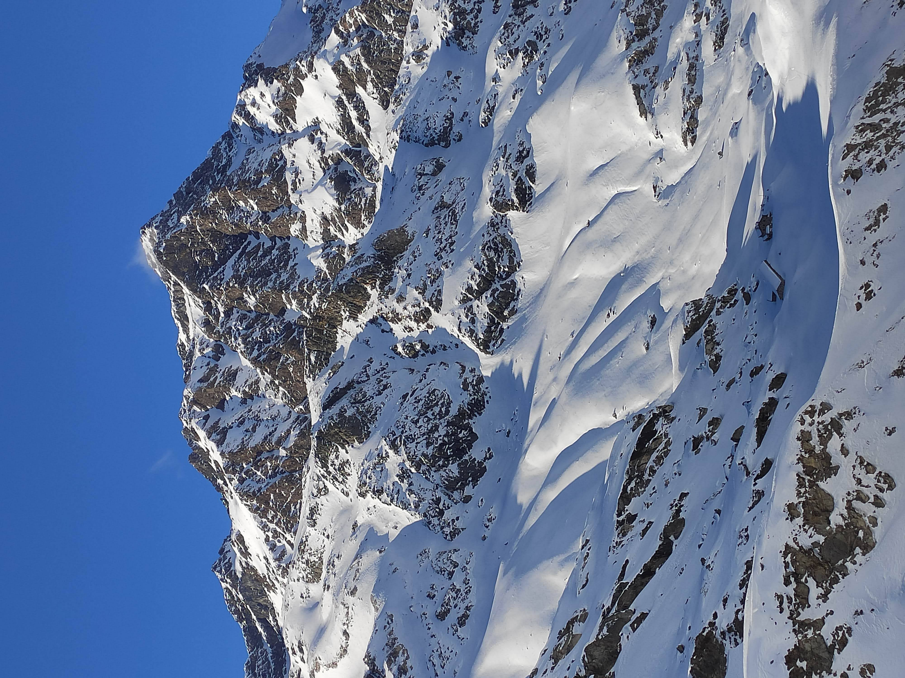
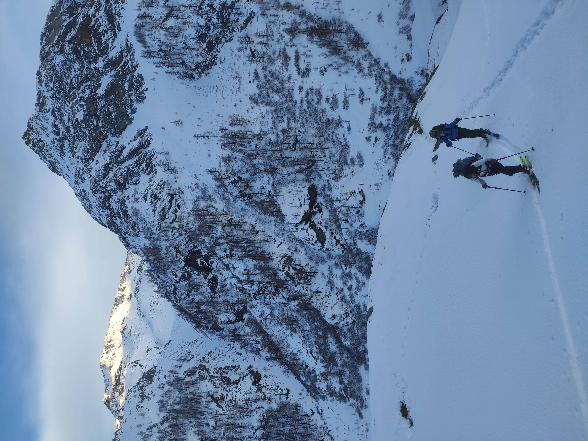
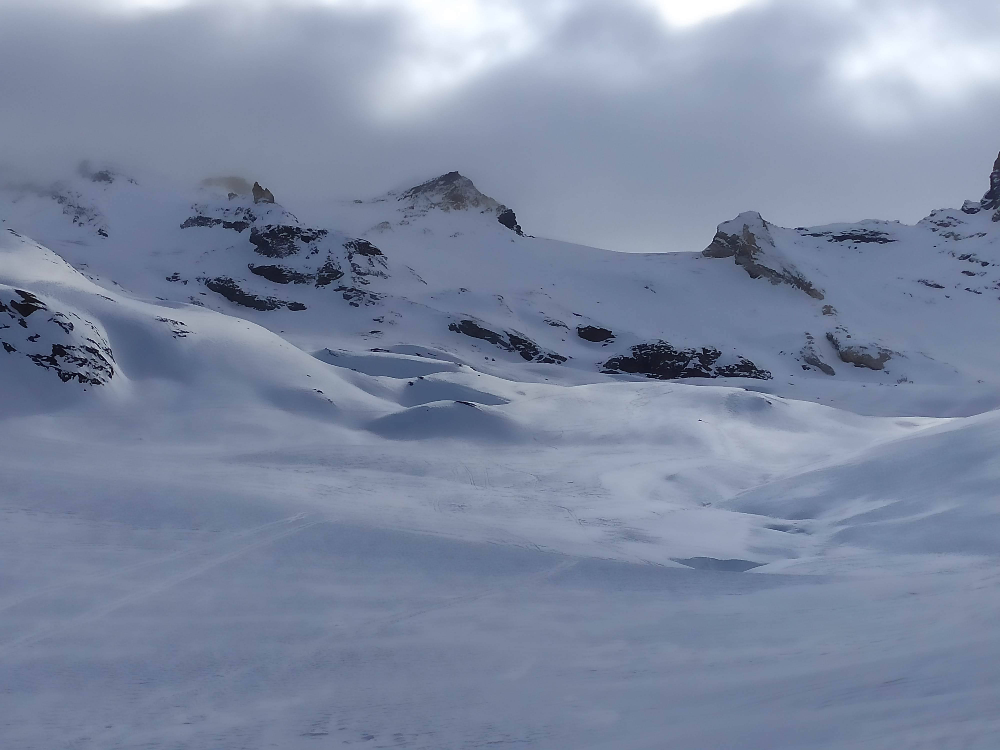
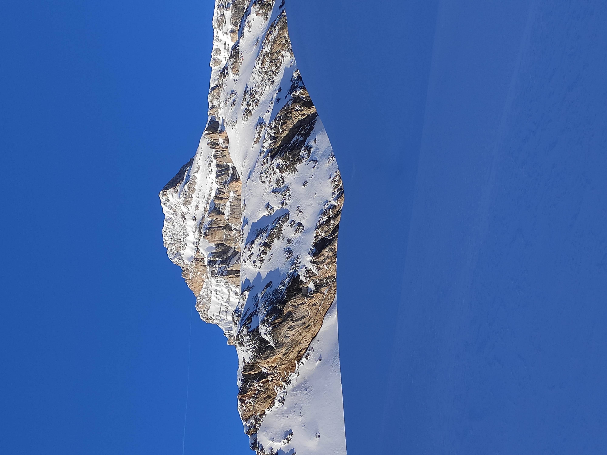
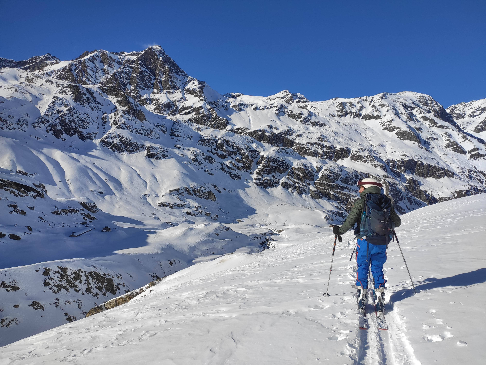
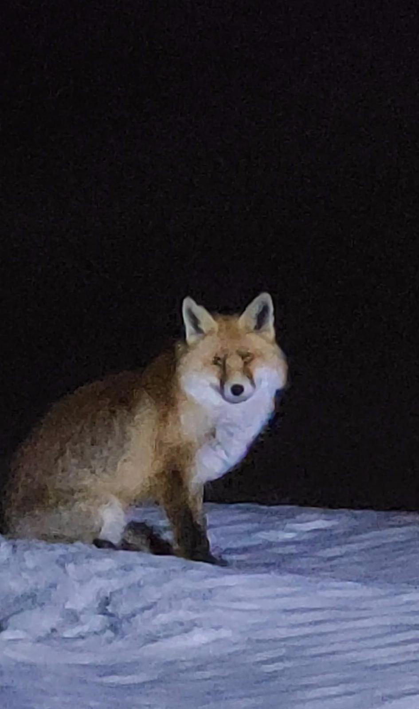
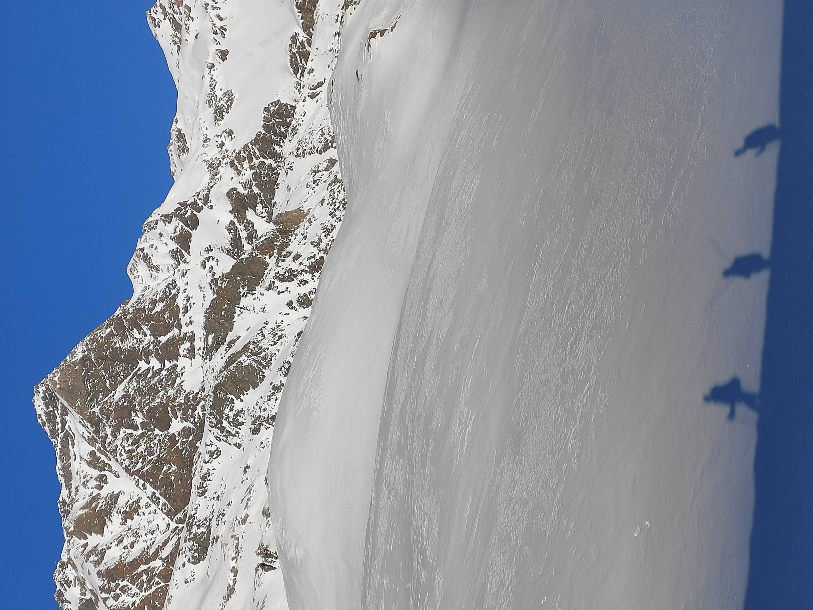
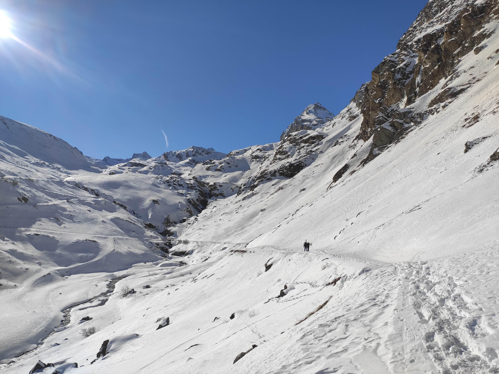

The 2022-2023 winter in Europe was historically bad for nature and snow sport enthusiasts. Aching for some ski-based adventures, a few friends and I went to [Rifugio Benevolo](https://rifugiobenevolo.com/) in early February.

I was still recovering from a back injury, so I was both restless to get on skis, but also cautious of relapses. Something about going somewhere that's difficult to get to seemed therapeutic (but definitely not logical).

Loading up our gear into a perfectly-sized Fiat Punto, we traversed the Swiss Alps to get to Italian Alps.

Rifugio Benevolo is located at 2,285m. Only a small shelter is open during the winter instead of the full hut.

The way up was beautiful but more difficult than we imagined, mostly because we took a less-frequented path. We arrived with headlamps blazing well past sunset.

We had the whole hut to ourselves for the whole weekend. Perhaps it wasn't surprising as the hut was not heated. The valley recorded temperatures of around -25°C the week before, and was forecast to be the same just after we would leave, but luckily we had a balmy 0°C (both inside and out).

While the snow quality wasn't the stuff of dreams, the landscape was. Multiple 3km peaks, pristine skies, and endless terrain to explore.

Our only visitor over the whole weekend was a fox!

It was magical to get out into nature again, especially with great friends. Ski touring is a great way to get your mind off of other worries as well (and to get into flow state).

As great as this escape was, we needed to get back to civilization and indoor heating.

