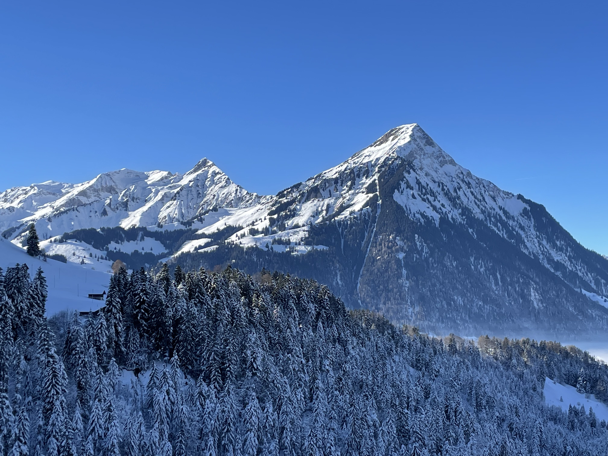
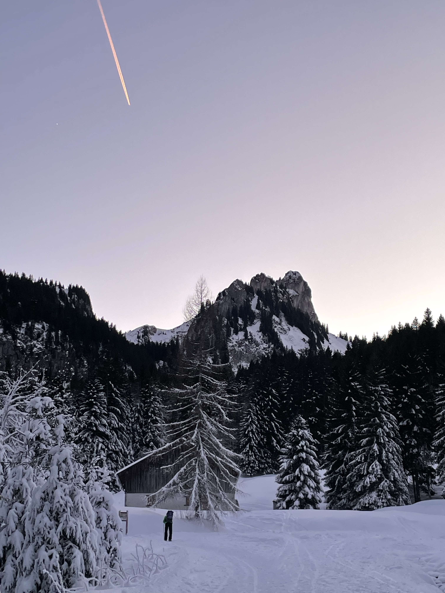

The two week break around Christmas and New Years was wonderful. It was very refreshing to spend less time in the daily routine, and more time away from screens and work tasks. We spent a lot of time with family and friends, enjoying nature, and being in the moment. Quality social time is so important, and we were fortunate enough to have a lot of it, if not borderline too much of it. We came away with calm, rested minds.

The final weeks of 2024 contained a flood to emails from my cloud storage providers telling me that I have no more storage space left. Instead of succumbing to their wishes, I spent the first week or two of the new year in the rabbit hole that is building a "homelab." Basically, have another computer that's on 24/7 run a service or services that you can connect to, primarily over your local network. The options are limitless.

It started with an an external 4TB HDD. Instead of having to plug it in every time I want to access files, it's instead plugged into an old laptop, which shares the HDD to any computer on our local network as a network drive. That then led to virtual machines, Docker containers, more refined network drive access, and a self-hosted Google Photos alternative called Immich to back up and host my photos.

The home lab / NAS community seems very _particular_ with setup requirements and suggestions, but my janky setup works as the primary goal of having more storage space accessible to my main laptop. I still have all of my data in other locations, and will continue to get storage warning emails from cloud providers until I build a robust backup strategy and migrate data to the homelab.

I might get tempted and actually build a "proper" setup, like using a dedicated mini computer with faster SSD storage so that I can edit photos over the network. Or maybe this rabbit hole will pass and I'll fork over some money to the big tech giants — time will tell. Time will also tell if write a proper post about my journey into this world.

Speaking of journeys, I finished reading the last book in the _Three Body Problem_ series, _Death's End_ by Liu Cixin. I really enjoyed the trilogy, especially the second and third books. Without spoiling anything, Liu Cixin builds an extremely expansive and creative literary universe with rather convincing future technology, and explores many of the political aspects of a, let's say, life-changing discovery that affects humanity as a whole. It veered a bit off the rails for me about a third of the way into the third book, which had me pause reading it for several months, but picking it up over the winter break was a nice way to re-enter the literary universe.

Another journey: for roughly a month, I'll be in the US due to two work trips. Between them, instead of doubling the my CO2 emissions with a second transatlantic flight, I'll stick around and visit some friends and family. It's an exciting work project involving ecosystem restoration, and a great professional opportunity to co-develop an app with end users. A month is a long time, which will be nice to spend with friends and family, but also hard to spend away from family and friends in my adopted home of Switzerland.

I hope I'm able to keep some momentum up on learning German, which is a goal of mine for 2025, but I'll be relieved to speak to people in my native language.
